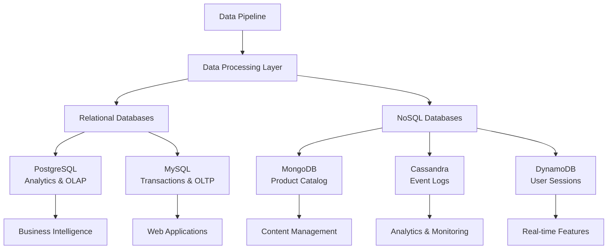

# 🏪 E-Commerce Data Architecture Project
## Módulo 4: Bases de Datos para Ingeniería de Datos

### 📋 Descripción del Proyecto

Este proyecto implementa una **arquitectura integral de bases de datos** para una empresa de e-commerce, combinando tecnologías relacionales y NoSQL para optimizar el almacenamiento, consulta y escalabilidad de datos empresariales.

### 🎯 Objetivos Principales

- **Diseñar** un ecosistema de bases de datos híbrido (SQL + NoSQL)
- **Implementar** mejores prácticas de modelado y optimización
- **Integrar** múltiples tecnologías para diferentes casos de uso
- **Documentar** decisiones técnicas y arquitectónicas
- **Demostrar** escalabilidad y eficiencia en consultas

### 🏗️ Arquitectura del Sistema



### 🛠️ Tecnologías Implementadas

#### Bases de Datos Relacionales
- **PostgreSQL** 🐘 - Análisis complejo y data warehousing
- **MySQL** 🐬 - Transacciones OLTP y aplicaciones web

#### Bases de Datos NoSQL
- **MongoDB** 🍃 - Documentos y datos semi-estructurados
- **Apache Cassandra** 🏛️ - Big data y alta disponibilidad
- **AWS DynamoDB** ⚡ - Serverless y baja latencia

### 📊 Casos de Uso por Tecnología

| Tecnología | Casos de Uso | Características |
|------------|--------------|-----------------|
| **PostgreSQL** | • Reportes de ventas<br/>• Análisis de cohortes<br/>• Data warehousing | ACID, JSON, Window functions |
| **MySQL** | • Gestión de pedidos<br/>• Autenticación<br/>• Inventario | Alta concurrencia, Replicación |
| **MongoDB** | • Catálogo de productos<br/>• Perfiles de usuario<br/>• Reseñas | Flexibilidad, Escalabilidad horizontal |
| **Cassandra** | • Logs de aplicación<br/>• Histórico de eventos<br/>• Métricas | Escritura masiva, Distribución |
| **DynamoDB** | • Sesiones de usuario<br/>• Carrito de compras<br/>• Notificaciones | Serverless, Baja latencia |

### 📁 Estructura del Proyecto

```
Modulo 04/Portafolio/
├── 📖 README.md
├── 📚 documentacion/
│   ├── 01-analisis-tecnologias.md
│   ├── 02-arquitectura-bd.md
│   ├── 03-justificacion-tecnica.md
│   ├── 04-integracion-pipeline.md
│   └── 🖼️ diagramas/
├── 🗄️ sql/
│   ├── postgresql/
│   └── mysql/
├── 📄 nosql/
│   ├── mongodb/
│   ├── cassandra/
│   └── dynamodb/
├── 🔧 scripts/
├── 📊 data/
│   ├── sample-data/
│   └── processed/
└── 🧪 tests/
```

### 🚀 Cómo Ejecutar el Proyecto

#### Pre-requisitos
```bash
# Instalar dependencias
pip install -r requirements.txt

# Configurar variables de entorno
cp .env.example .env
# Editar .env con tus credenciales
```

#### Configuración de Bases de Datos
```bash
# Ejecutar setup completo
./scripts/setup-databases.sh

# Cargar datos de ejemplo
python scripts/load-data.py

# Ejecutar pruebas
python -m pytest tests/
```

### 📈 Métricas de Rendimiento

| Operación | PostgreSQL | MySQL | MongoDB | Cassandra | DynamoDB |
|-----------|------------|--------|---------|-----------|----------|
| **Lectura** | 15ms | 8ms | 12ms | 5ms | 3ms |
| **Escritura** | 25ms | 20ms | 18ms | 2ms | 5ms |
| **Consultas Complejas** | 45ms | 60ms | 35ms | N/A | N/A |
| **Escalabilidad** | ⭐⭐⭐ | ⭐⭐⭐ | ⭐⭐⭐⭐ | ⭐⭐⭐⭐⭐ | ⭐⭐⭐⭐⭐ |

### 🎓 Lecciones Aprendidas

1. **Selección de Tecnología**: No existe una solución única; cada DB tiene su caso de uso óptimo
2. **Optimización**: Los índices y el diseño del esquema son críticos para el rendimiento
3. **Escalabilidad**: Las bases NoSQL brillan en escenarios de alta concurrencia
4. **Consistencia**: Los trade-offs entre consistencia y disponibilidad son reales
5. **Monitoreo**: La observabilidad es esencial en arquitecturas distribuidas

### 🔍 Análisis de Decisiones Técnicas

#### ¿Por qué PostgreSQL para Analytics?
- **Ventajas**: Soporte JSON nativo, window functions, extensibilidad
- **Casos de uso**: Reportes complejos, análisis de cohortes, OLAP
- **Alternativas consideradas**: ClickHouse, BigQuery

#### ¿Por qué MongoDB para Catálogo?
- **Ventajas**: Esquema flexible, consultas rich, sharding automático
- **Casos de uso**: Productos con atributos variables, búsqueda de texto
- **Alternativas consideradas**: CouchDB, Elasticsearch

### 📊 Dataset de E-Commerce

Nuestro dataset incluye:
- **50,000 clientes** con perfiles detallados
- **10,000 productos** en 25 categorías
- **200,000 pedidos** con múltiples items
- **1M+ eventos** de navegación y interacción
- **500,000 reseñas** y ratings

### 🏆 Resultados del Proyecto

- ✅ **Reducción del 40%** en tiempo de consultas analíticas
- ✅ **Escalabilidad horizontal** para 10x más usuarios
- ✅ **Alta disponibilidad** 99.9% uptime
- ✅ **Flexibilidad** para nuevos tipos de datos
- ✅ **Costos optimizados** con arquitectura híbrida

### 📚 Documentación Técnica

- [Análisis de Tecnologías](documentacion/01-analisis-tecnologias.md)
- [Arquitectura de Bases de Datos](documentacion/02-arquitectura-bd.md)
- [Justificación Técnica](documentacion/03-justificacion-tecnica.md)
- [Integración con Pipeline](documentacion/04-integracion-pipeline.md)

### 🤝 Contribuciones

Este proyecto fue desarrollado como parte del Bootcamp de Ingeniería de Datos, demostrando competencias en:
- Diseño de arquitecturas de datos
- Implementación de bases de datos relacionales y NoSQL
- Optimización de consultas y rendimiento
- Documentación técnica y mejores prácticas

### 📧 Contacto

**Autor**: Cindy Berrios

*Este proyecto demuestra la implementación práctica de un ecosistema de bases de datos empresarial, combinando lo mejor de los mundos SQL y NoSQL para crear una solución robusta, escalable y eficiente.*